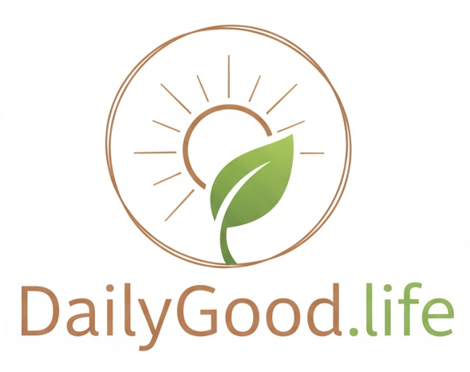

 

# 项目简介

互联网,AI,短视频,直播,游戏,区块链等等在过去20年迅速发展。当技术迅速发展,世界发生翻天覆地的变化,对于活在这段时间的人们,技术带来的不是安逸舒适幸福,而是混乱和麻木。对此,我想要去探讨什么样的生活是好的？如何好好的生活？
> While technology has reshaped our world, it hasn't necessarily healed our minds. Instead of comfort, we often feel chaos. Here, we pause to ask the essential question: In a digital age, what does it mean to truly live a good life?

我们首先确保做能够让我们自己生活的变好的事情,然后把这个东西分享出去,就能够改变世界,让这个世界变得更好。
